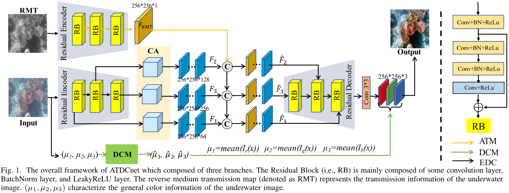

# Transmission and Color-guided Network for Underwater Image Enhancement (ICME 2023)([Paper](https://arxiv.org/pdf/2308.04892.pdf))
The Pytorch Implementation of ''Transmission and Color-guided Network for Underwater Image Enhancement''. 

<div align=center></div>

## Introduction
In this project, we use Ubuntu 20.04.1, Python 3.8, Pytorch 1.11.0 and one NVIDIA RTX A6000 GPU. 

## Running

### Testing

Download the pretrained model [pretrained model](https://drive.google.com/file/d/1KQYYWpcTwE6lTzJlu4NeImIwAHWWmb-N/view?usp=drive_link).

Check the model and image pathes in test.py, and then run:

```
python test.py
```
### Training

To train the model, you need to prepare our [dataset](https://drive.google.com/file/d/1YXdyNT9ac6CCpQTNKP7SnKtlRyugauvh/view?usp=sharing).

Check the dataset path in train.py, and then run:
```
python train.py
```

## Citation

If you find ATDCnet is useful in your research, please cite our paper:

```
@article{mu2023transmission,
  title={Transmission and Color-guided Network for Underwater Image Enhancement},
  author={Mu, Pan and Fang, Jing and Qian, Haotian and Bai, Cong},
  journal={arXiv preprint arXiv:2308.04892},
  year={2023}
}
```

